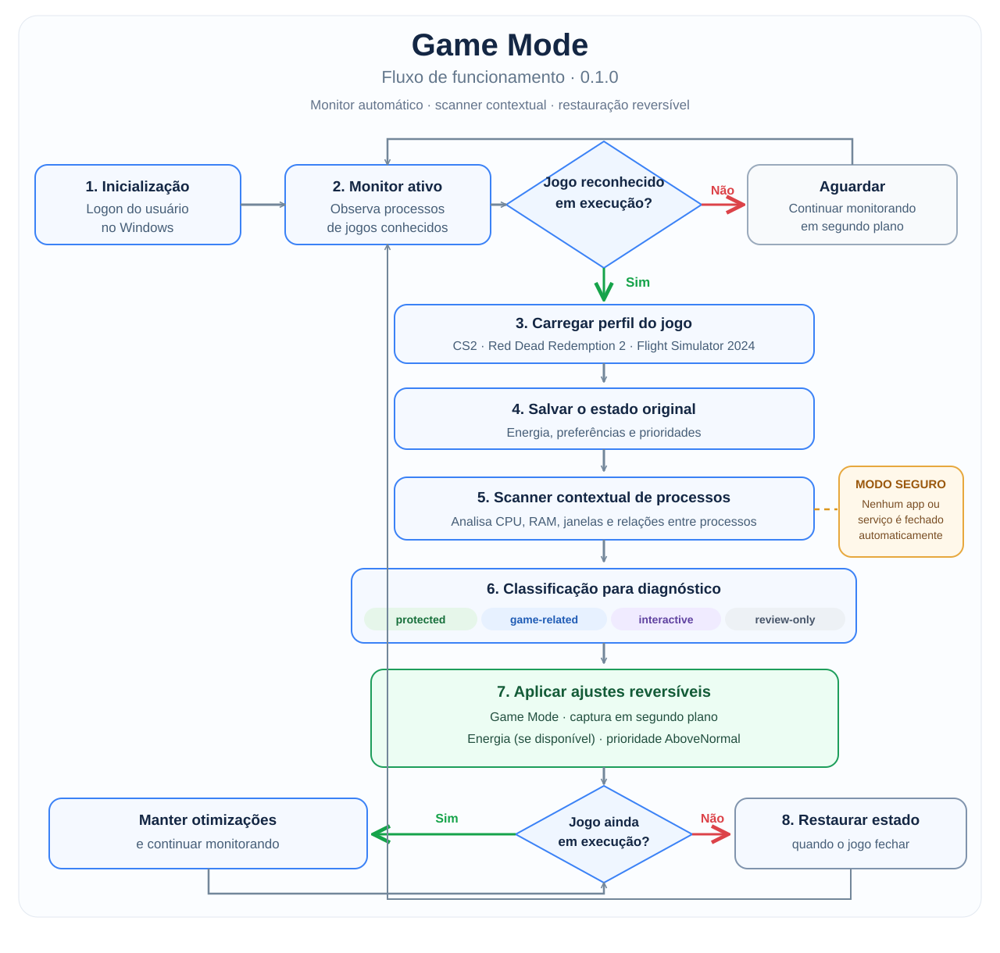

# Game Mode

**Versão 0.1.0 · experimental · Windows 11 · PowerShell 5.1**

Otimizador pessoal e modular para Windows. Detecta um jogo em execução, examina os processos presentes **naquela sessão**, aplica somente ajustes de desempenho reversíveis e restaura o estado anterior quando o jogo termina.

> Este projeto está em desenvolvimento. A versão inicial **não encerra programas ou serviços automaticamente**, pois consumo de recursos, ausência de janela e ociosidade não provam que um processo pode ser interrompido sem danos. O scanner cria candidatos para análise. Não há promessa de ganho de FPS.

## Fluxo de funcionamento

O diagrama resume como o monitor detecta um jogo, registra o estado atual do Windows, faz uma análise contextual dos processos e aplica apenas ajustes reversíveis. Ao fechar o jogo, o programa tenta restaurar as configurações anteriores.

> **Importante:** na versão experimental 0.1.0, o scanner apenas **analisa** processos. Ele não encerra aplicativos, serviços ou subsistemas automaticamente.

## Jogos reconhecidos

| Jogo | Processo monitorado |
| --- | --- |
| Counter-Strike 2 | `cs2.exe` |
| Red Dead Redemption 2 | `RDR2.exe` |
| Microsoft Flight Simulator 2024 | `FlightSimulator2024.exe` |

## Instalação

1. Feche os modos anteriores de otimização manual, se estiverem ativos.
2. No GitHub, clique em **Code → Download ZIP** (ou use `git clone https://github.com/eduardozfr/game-mode.git`).
3. **Extraia o ZIP** em qualquer pasta, por exemplo `Downloads\game-mode`. Não execute os arquivos diretamente dentro do ZIP.
4. Entre na pasta extraída e execute **`INSTALAR.cmd`** como usuário normal (não precisa ser administrador). O instalador copia os arquivos para `%LOCALAPPDATA%\GameMode`; não é preciso colocar manualmente nada em `Program Files`.
5. Abra normalmente um dos jogos reconhecidos.
6. Execute `STATUS.cmd` para conferir o perfil e o estado do monitor.
7. Para parar o monitor e restaurar as alterações temporárias, use `RESTAURAR.cmd`.
8. Para voltar a detectar jogos, use `REATIVAR.cmd`. Para remover a automação, `DESINSTALAR.cmd`.

Instalação por usuário em `%LOCALAPPDATA%\GameMode`; os relatórios são locais e não são enviados para a Internet.

## Como funciona

1. O monitor em segundo plano identifica jogos pelo processo.
2. O scanner coleta uma amostra da sessão: consumo de CPU/RAM, janela, identificador do processo, associação a serviços e ascendência do processo.
3. Processos são classificados em `protected`, `game-related`, `interactive` e `review-only`. A classificação **não autoriza encerramentos**.
4. São aplicadas preferências temporárias: Game Mode, desativação de captura em segundo plano e plano de alto desempenho **quando disponível**. A prioridade do jogo pode passar de `Normal` para `AboveNormal`, se permitida.
5. Ao sair do jogo, preferências e prioridades são restauradas. O estado também pode ser recuperado após um encerramento inesperado.

## Segurança

- Nunca desativa antivírus, firewall, Windows Update, drivers, áudio, rede, anti-cheat ou controle térmico.
- Não usa `Stop-Process -Force`, `Stop-Service` ou `wsl --shutdown`.
- Não modifica BIOS, overclock, temporizadores, BCD ou configurações de segurança do Windows.
- Não altera o conteúdo dos arquivos do jogo.
- Evita registrar caminhos completos pessoais, títulos de janelas ou linhas de comando em relatórios.
- Preferências do Windows podem falhar por política ou falta de permissão; o monitor registra essa condição e prossegue.

## Projeto e versões

O código começa em **0.1.0** (primeira versão pública experimental). A evolução seguirá o [Versionamento Semântico](https://semver.org/lang/pt-BR/): `0.x` durante desenvolvimento e `1.0.0` após homologação. As versões de scripts de diagnóstico pessoais anteriores não fazem parte da numeração deste repositório.

- [Arquitetura](docs/ARCHITECTURE.md)
- [Segurança e processos](docs/PROCESS_POLICY.md)
- [Adicionar jogos](docs/ADDING_GAMES.md)
- [Testes e limitações](docs/TESTING.md)
- [Histórico](CHANGELOG.md)

Código aberto sob licença MIT.
